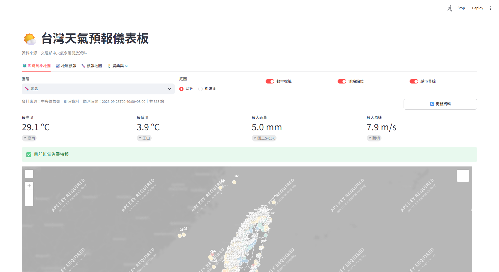
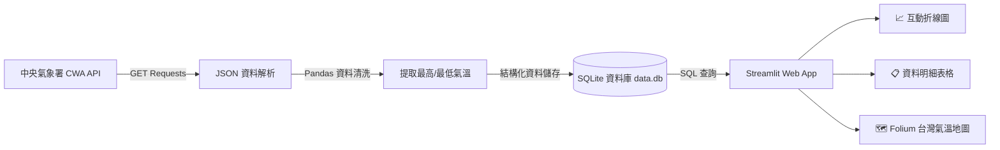

# 🌤️ Taiwan Weather Forecast 台灣天氣預報互動儀表板

> **從氣象資料到互動式天氣預報應用**  
> *用程式探索天氣 · 用資料看見台灣 · 用 AI 實現更多可能*

[](https://www.python.org/)
[](https://streamlit.io/)
[](https://www.sqlite.org/)
[](https://opendata.cwa.gov.tw/)
[](https://opensource.org/licenses/MIT)

## 🔗 專案連結

- [GitHub 儲存庫：john19991225-commits/0923](https://github.com/john19991225-commits/0923)
- 本機啟動網址：[http://localhost:8501](http://localhost:8501)

> `localhost` 僅能在已啟動本專案的電腦上開啟。

## 🖼️ 系統畫面



---

## 📖 專案簡介 (Overview)

本專案為 **AI 創新微課程** 之實作專案，完整涵蓋現代資料應用開發流程：從串接**交通部中央氣象署 (CWA) 開放資料平台 API**、JSON 資料解析、Pandas 資料前處理、儲存至 **SQLite 資料庫**，最後使用 **Streamlit** 與 **Folium** 打造出具備互動式折線圖、即時資料表以及台灣地圖地理視覺化的全方位氣象儀表板。

---

## 🌟 核心特色 (Key Features)

- 📡 **氣象署開放 API 串接**：利用 `requests` 模組自動調用中央氣象署 (CWA) Open Data RESTful API，即時取得全台天氣預報 JSON。
- 🧹 **資料結構化與清洗**：解析層級深且複雜的 JSON 結構，提取各地區最高溫 (`MaxT`) 與最低溫 (`MinT`)，使用 `pandas` 整理為標準資料表。
- 💾 **SQLite 資料持久化**：設計輕量關聯式資料庫 `data.db`，建立健全 schema 與避免重複寫入邏輯，支援高效 SQL 查詢。
- 📈 **互動式趨勢分析**：透過 Streamlit 下拉選單切換地區，即時繪製未來一週最高與最低溫趨勢折線圖及表格清單。
- 🗺️ **台灣地圖地理視覺化**：結合 `folium` 與 `streamlit-folium`，以色階動態呈現全台各分區氣溫分佈，支援日期選取聯動。
- 🛠️ **模組化與高品質程式碼**：具備例外錯誤處理、資料防呆、清晰註解與模組化架構。

---

## 🏗️ 系統架構 (System Architecture)



---

## 🗄️ 資料庫架構 (Database Schema)

資料庫使用 SQLite (`data.db`)，核心資料表結構如下：

### 表名稱：`TemperatureForecasts`

| 欄位名稱 (Column) | 資料型態 (Type) | 說明 (Description) |
| :--- | :--- | :--- |
| `id` | `INTEGER` | 主鍵，自動遞增 (PRIMARY KEY AUTOINCREMENT) |
| `regionName` | `TEXT` | 地區名稱（如：北部地區、中部地區、南部地區等） |
| `dataDate` | `TEXT` | 預報日期（格式：YYYY-MM-DD） |
| `mint` | `REAL` | 最低氣溫 (°C) |
| `maxt` | `REAL` | 最高氣溫 (°C) |

---

## 🛠️ 技術棧 (Tech Stack)

| 領域 | 技術 / 套件 | 說明 |
| :--- | :--- | :--- |
| **程式語言** | `Python 3.9+` | 專案核心開發語言 |
| **API 串接** | `requests` | HTTP API 呼叫與認證標頭管理 |
| **資料處理** | `pandas`, `json` | 資料清洗、欄位塑型與轉換 |
| **資料儲存** | `sqlite3` | 輕量化關聯式資料庫 |
| **Web 框架** | `streamlit` | 快速建構互動式資料視覺化儀表板 |
| **地圖視覺化** | `folium`, `streamlit-folium` | 台灣地圖繪製與區塊氣溫色階渲染 |
| **圖表繪製** | `matplotlib` / `plotly` | 溫差趨勢折線圖動態繪製 |
| **版本控制** | `Git` & `GitHub` | 程式碼備份與協同管理 |

---

## 🚀 快速開始 (Quick Start)

### 1. 複製儲存庫
```bash
git clone https://github.com/john19991225-commits/0923.git
cd 0923
```

### 2. 建立虛擬環境 (建議)
```bash
# Windows
python -m venv venv
.\venv\Scripts\activate

# macOS / Linux
python3 -m venv venv
source venv/bin/activate
```

### 3. 安裝相依套件
```bash
pip install requests pandas streamlit folium streamlit-folium
```

### 4. 設定 CWA API Key
前往 [中央氣象署開放資料平台](https://opendata.cwa.gov.tw/) 註冊並取得免費授權碼 (API Key)。

### 5. 擷取資料並寫入資料庫
```bash
python fetch_weather.py
```

### 6. 啟動 Streamlit 儀表板
```bash
streamlit run app.py
```
啟動後瀏覽器將自動開啟 `http://localhost:8501`。

---

## 🗺️ 專案目錄結構 (Project Structure)

```text
0923/
├── data/
│   └── data.db                # SQLite 氣溫資料庫
├── .gitignore                 # Git 忽略設定
├── README.md                  # 專案說明文件
├── requirements.txt           # Python 相依套件清單
├── fetch_weather.py           # API 抓取、JSON 解析與資料寫入邏輯
└── app.py                     # Streamlit 網頁應用與視覺化主程式
```

---

## 📚 學習模組里程碑 (24 課開發地圖)

- [x] **階段 1：基礎與資料取得**
  - 01 課程介紹 ＆ 02 台灣氣候概念
  - 03 CWA Open Data 帳號註冊與金鑰申請
  - 04 使用 Requests 串接 API 取得 JSON
- [x] **階段 2：資料解析與資料庫建立**
  - 05 JSON 結構探索 ＆ 06 提取 MinT / MaxT 溫標
  - 07 Pandas 清洗與預覽
  - 08-10 規劃 SQLite (`data.db`)、Schema 設計與 SQL 語法驗證
- [x] **階段 3：Streamlit 互動前端開發**
  - 11 Streamlit 快速上手 ＆ 12 SQL 資料讀取
  - 13 地區下拉選單聯動 (Select Region)
  - 14-16 一週溫差折線圖、資料表格清單與整合介面
- [x] **階段 4：地理視覺化與優化部署**
  - 17-18 Folium 台灣氣溫互動地圖與日期篩選
  - 19 完整 Taiwan Weather Dashboard
  - 20 程式品質重構（防呆、去重、例外處理）
  - 21-24 GitHub 託管備份、延伸應用探索
---

## 🔮 未來展望與延伸應用 (Future Roadmap)

- 🤖 **LINE Bot 晨間推播**：整合 LINE Messaging API，早晨自動發送各地當日溫差提醒。
- 🧳 **智慧旅遊與穿搭推薦**：結合 OpenAI / Claude 大型語言模型 (LLM)，依預報氣溫自動產生穿搭與出遊建議。
- 🌾 **農業防減災預警**：針對極端低溫或連續降雨發送寒害及農作物防範預警。

---

## 👨‍🏫 講師與版權致謝

- **課程導師**：煥哥 (*與你一起用 AI 寫程式，探索更大的世界！*)
- **資料來源**：[交通部中央氣象署 CWA Open Data](https://opendata.cwa.gov.tw/)
