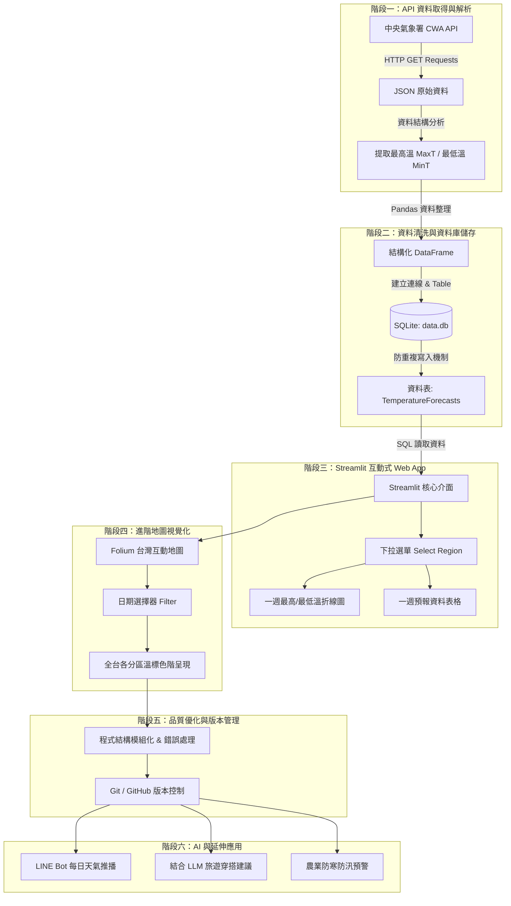

# 📋 Taiwan Weather Forecast 專案開發工作流程 (Workflow)

> 本文件依據「**AI 創新微課程：Taiwan Weather Forecast**」24 模組藍圖規劃，詳細記錄從資料源串接、資料庫持久化、前端 Streamlit 儀表板到地理資訊視覺化的完整專案工作流程。

---

## 🗺️ 總體架構與工作流程圖 (Workflow Diagram)



---

## 🛠️ 各階段詳細執行步驟 (Step-by-Step Breakdown)

### 階段一：API 資料取得與解析 (步驟 1 ~ 6)
1. **申請氣象署 API 金鑰**：
   - 於 [中央氣象署開放資料平台](https://opendata.cwa.gov.tw/) 註冊並取得授權金鑰 (API Key)。
2. **使用 Requests 發送 API 請求**：
   - 使用 `requests.get()` 取得 JSON 資料。
   ```python
   import requests

   url = f"https://opendata.cwa.gov.tw/api/v1/rest/datastore/F-C0032-001?Authorization={API_KEY}"
   resp = requests.get(url)
   data = resp.json()
   ```
3. **JSON 階層拆解與提取**：
   - 定位 `records -> location` 陣列。
   - 解析各分區 weatherElement：取得 `MinT`（最低氣溫）與 `MaxT`（最高氣溫）。

---

### 階段二：資料清洗與 SQLite 資料庫 (步驟 7 ~ 10)
1. **Pandas 整理資料**：
   - 將 JSON 轉為結構化的 DataFrame，包含 `regionName`、`dataDate`、`mint`、`maxt` 欄位。
2. **建立 SQLite 資料庫 (`data.db`)**：
   - 資料表 Schema 設計：
   ```sql
   CREATE TABLE IF NOT EXISTS TemperatureForecasts (
       id INTEGER PRIMARY KEY AUTOINCREMENT,
       regionName TEXT,
       dataDate TEXT,
       mint REAL,
       maxt REAL,
       UNIQUE(regionName, dataDate)
   );
   ```
3. **防重複寫入與驗證**：
   - 使用 `INSERT OR REPLACE` 或 `INSERT OR IGNORE` 確保重複執行資料抓取時不重複插入資料。
   - SQL 驗證指令：
     ```sql
     SELECT DISTINCT regionName FROM TemperatureForecasts;
     SELECT * FROM TemperatureForecasts WHERE regionName = '中部地區';
     ```

---

### 階段三：Streamlit 互動儀表板 (步驟 11 ~ 16)
1. **安裝與環境初始化**：
   - 安裝 Streamlit：`pip install streamlit`
2. **SQL 資料讀取**：
   - 使用 `sqlite3` 連線 `data.db`，以 `pandas.read_sql_query()` 讀取所需資料。
3. **建立互動式 UI 元件**：
   - 地區下拉式選單 (`st.selectbox("選擇地區", regions)`)。
   - 繪製氣溫折線圖（MaxT vs MinT）。
   - 清楚呈現一週預報資料表格 (`st.dataframe`)。

---

### 階段四：台灣地圖視覺化 (步驟 17 ~ 19)
1. **導入 Folium 地圖庫**：
   - 使用 `folium` 與 `streamlit-folium` 繪製互動式地圖。
2. **氣溫色階渲染**：
   - 依據平均溫度或最高溫劃分顏色區間：
     - 藍色：< 20°C
     - 綠色：20 - 25°C
     - 黃橘色：25 - 30°C
     - 紅色：> 30°C
3. **日期連動檢視**：
   - 使用日期選取器 (`st.date_input`) 即時動態切換各區地圖天氣分佈。

---

### 階段五：程式碼品質與 Git 託管 (步驟 20 ~ 21)
1. **程式碼重構與防呆**：
   - 加入 `try-except` 例外處理機制（如網路連線逾時、JSON 格式異常）。
   - 模組化切分：資料擷取邏輯 (`fetch_weather.py`) 與前端介面 (`app.py`) 分離。
2. **Git / GitHub 管理**：
   - 透過 Git 進行版本追蹤，定期 Commit 與 Push 至遠端儲存庫。

---

### 階段六：延伸應用探索 (步驟 22 ~ 24)
- 📲 **LINE Bot 自動推播**：整合 LINE Messaging API，每日早晨自動推播今日出門溫差提醒。
- 🤖 **結合 AI 大語言模型**：串接 OpenAI / Claude API，根據天氣預報產生個人化旅遊行程與穿搭建議。
- 🌾 **智慧農業與防災警報**：寒流或劇烈溫差即時通報，守護農漁作物。

---

## 📌 模組進度查核清單 (Progress Checklist)

| 編號 | 任務項目 | 狀態 |
| :---: | :--- | :---: |
| 01-04 | CWA API 帳號註冊、Key 申請與 Requests 資料取得 | ✅ 已完成 |
| 05-06 | JSON 提取 MinT / MaxT 轉換結構化資料 | ✅ 已完成 |
| 07-10 | Pandas 資料整理與 SQLite data.db 持久化儲存 | ✅ 已完成 (階段二) |
| 11-16 | Streamlit 下拉選單、折線圖與表格整合 | ✅ 已完成 (階段三) |
| 17-19 | Folium 台灣地圖色階可視化與日期篩選 | ✅ 已完成 (階段四) |
| 20-21 | 程式碼異常處理、重構優化與 GitHub 上傳 | ✅ 已完成 (階段五) |
| 22-24 | LINE Bot、AI 建議與農業警示實作 | ✅ 已完成 (階段六) |
